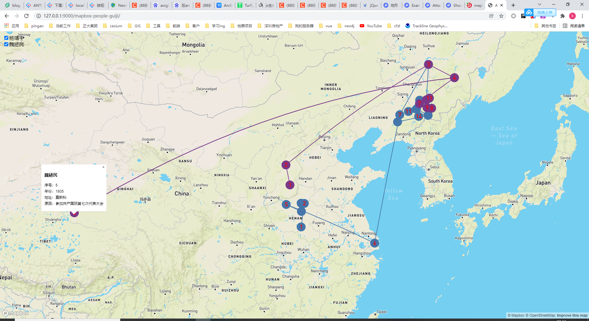

# mapbox-examples

#### 介绍
个人学习，工作中开发的一些mapbox案例集合

#### 软件架构
软件架构说明

#### 安装教程

1.  yarn
2.  yarn start

#### 使用说明

1.  xxxx
2.  xxxx
3.  xxxx

#### 目录说明

1. 【mapbox-monitor-car0分支】 cd 目录中， node server.js启动
一条监控车辆行驶汽车轨迹，buffer一个容差圆，随机落点一个经纬度模拟接收信号坐标，落在圆内正常蓝色，园外异常红色，实时计算坐标并画折现

2. 【mapbox-monitor-car】 新增模拟udp接收通信+websocket传输给前端
cd 目录中， node server.js启动 （同时启动了udp server） 单独开启一个窗口node udpClient.js 启动udp客户端向server传输数据
一条监控车辆行驶汽车轨迹，buffer一个容差圆，随机落点一个经纬度模拟接收信号坐标，落在圆内正常蓝色，园外异常红色，实时计算坐标并画折现
3. 【mapbox-people-guiji】纯html写mapbox 带弧线的轨迹。

4. 【ol-ext-geoserver-popup-layerswitch】纯html写openlayer（ol-ext） 图层管理，弹窗查询，常规坐标系。
4. 【ol-ext-geoserver-popup-layerswitch-proj4js】纯html写openlayer（ol-ext） 图层管理，弹窗查询，国外地方坐标系。

5. 【mapbox-news-location】 
    mapbox实现，滑动查看新闻并定位坐标，支持移动端，对标 
6. 【neo4j-neovis】
    neovis 实现neo4j数据可视化表达
7. 【leaflet-wfs】
    index.html 原始请求geoserver示例，index-wfs.html javaservlet实现的wfs（矢量）加载
